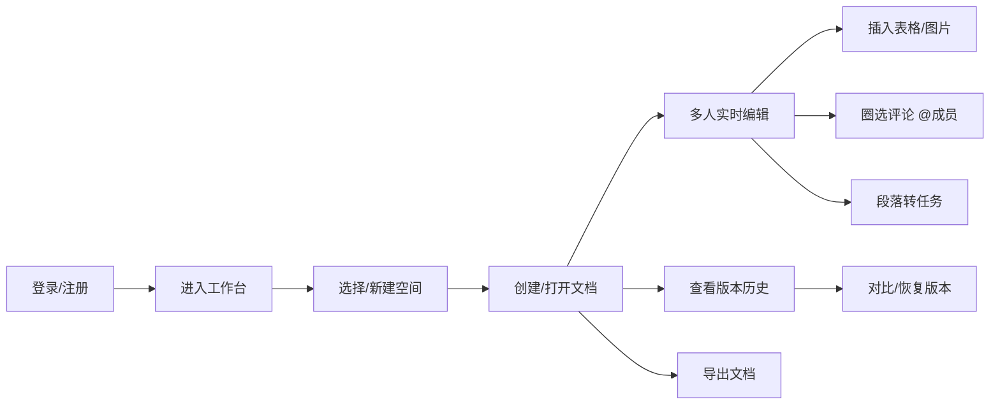

## 1. 产品概述

一款面向小团队的在线协作文档 Web 应用，帮助团队共同撰写方案、跟进事项，提升团队协作效率与信息同步速度。通过集成文档协作、白板讨论、任务管理、日程安排、消息通知等功能，打造一站式团队协作平台。

- 核心价值：打破信息孤岛，让团队成员在统一平台上完成方案撰写、头脑风暴、任务追踪、会议协调等工作
- 目标用户：10-50 人的小型团队，包括产品团队、项目团队、创业团队等

---

## 2. 核心功能

### 2.1 用户角色

| 角色 | 注册方式 | 核心权限 |
|------|----------|----------|
| 团队管理员 | 邮箱/手机号注册 | 空间管理、成员管理、权限配置、查看团队活跃度 |
| 普通成员 | 邮箱/手机号注册 | 创建/编辑文档、白板协作、任务管理、日程查看、消息收发 |
| 访客 | 邀请链接 | 查看指定文档、添加评论（受限权限） |

### 2.2 功能模块

1. **工作台**：数据概览、最近访问、待办任务、团队动态
2. **文档**：多级文档管理、富文本编辑、版本历史、评论协作、权限控制
3. **白板**：无限画布、便签拖拽、图形绘制、多人实时协作
4. **任务**：任务看板、任务详情、负责人/截止日期、进度追踪
5. **日程**：日历视图、会议安排、日程同步、提醒通知
6. **消息**：消息列表、@提醒、评论通知、系统公告
7. **管理**：空间管理、成员管理、权限配置、团队活跃度、回收站

### 2.3 页面详情

| 页面名称 | 模块名称 | 功能描述 |
|---------|----------|----------|
| 工作台 | 数据概览 | 展示团队文档数、任务完成率、今日日程、未读消息 |
| 工作台 | 快捷入口 | 新建文档、新建白板、新建任务、新建日程快速按钮 |
| 工作台 | 最近访问 | 展示最近编辑/查看的文档、白板、任务 |
| 工作台 | 团队动态 | 展示团队成员的操作动态时间线 |
| 文档 | 空间列表 | 展示所有空间，支持新建、搜索、收藏 |
| 文档 | 目录树 | 多级文件夹/文档目录树，支持拖拽排序 |
| 文档 | 富文本编辑器 | 支持标题、段落、列表、表格、图片、代码块、引用 |
| 文档 | 版本历史 | 保存历史版本，支持对比、恢复、版本备注 |
| 文档 | 评论协作 | 圈选内容评论、@成员、回复评论、解决评论 |
| 文档 | 段落转任务 | 选中段落一键转为任务，自动关联文档 |
| 文档 | 搜索 | 按关键词全文搜索文档内容 |
| 文档 | 导出 | 支持导出为 Markdown、PDF、Word 格式 |
| 白板 | 画布操作 | 无限画布、缩放、平移、网格背景 |
| 白板 | 便签功能 | 创建便签、拖拽移动、调整大小、颜色标记 |
| 白板 | 协作功能 | 多人光标、实时同步、指针位置显示 |
| 任务 | 看板视图 | 按状态列展示任务，拖拽切换状态 |
| 任务 | 任务详情 | 任务描述、负责人、截止日期、优先级、子任务 |
| 任务 | 筛选排序 | 按负责人、状态、优先级、截止日期筛选 |
| 日程 | 日历视图 | 月/周/日视图切换，展示会议和事件 |
| 日程 | 会议安排 | 创建会议、邀请成员、设置会议室、添加议程 |
| 日程 | 提醒设置 | 会前提醒、日程同步到日历 |
| 消息 | 消息列表 | 所有消息集中展示，按类型分类 |
| 消息 | @提醒 | 单独展示 @ 我的消息，标记已读/未读 |
| 消息 | 评论通知 | 文档评论、任务评论通知 |
| 管理 | 空间管理 | 新建空间、编辑信息、设置空间权限 |
| 管理 | 成员管理 | 邀请成员、编辑角色、移除成员 |
| 管理 | 权限配置 | 按文件夹设置查看/编辑/管理权限 |
| 管理 | 团队活跃度 | 统计成员活跃度、文档贡献、任务完成情况 |

---

## 3. 核心流程

### 3.1 文档协作流程

用户登录后进入工作台，可选择已有空间或新建空间，在空间内创建多级文档结构。编辑文档时支持多人同时编辑，实时看到其他成员的光标位置。编辑过程中可插入表格、图片，选中内容添加评论并 @ 成员提醒。重要段落可一键转为任务，设置负责人和截止日期。编辑历史自动保存，可随时查看版本历史并恢复。

### 3.2 任务管理流程

用户可在工作台或任务页面创建任务，设置负责人、截止日期、优先级。任务以看板形式展示，可拖拽切换状态。任务详情中可添加评论、上传附件、创建子任务。任务完成后标记为已完成，系统自动同步到团队活跃度统计。

---

## 4. 用户界面设计

### 4.1 设计风格

- **主色调**：深海蓝 `#1E3A5F` - 专业、稳重、信任感
- **辅助色**：活力橙 `#FF6B35` - 强调、行动按钮、重要提醒
- **成功色**：薄荷绿 `#2EC4B6` - 完成状态、成功提示
- **警告色**：琥珀黄 `#FFB627` - 警告、待处理
- **背景色**：渐变灰蓝 `#F8FAFC` 到 `#EEF2F7` - 清爽、现代感
- **字体**：
  - 标题：`"Noto Serif SC"`, 衬线字体，营造专业文档感
  - 正文：`"Inter"`, 无衬线字体，保证阅读舒适度
  - 代码：`"JetBrains Mono"`, 等宽字体
- **按钮风格**：圆角 8px，微妙阴影，悬停时有轻微上浮动画
- **卡片风格**：圆角 12px，柔和阴影，悬停时阴影加深
- **布局风格**：三栏布局（侧边导航 + 内容区 + 详情面板），响应式自适应
- **图标风格**：线性图标，统一 24px 尺寸，颜色跟随主题

### 4.2 页面设计概述

| 页面名称 | 模块名称 | UI 元素 |
|---------|----------|----------|
| 工作台 | 数据概览 | 统计卡片（渐变背景+图标+数字）、环形进度图 |
| 工作台 | 快捷入口 | 图标按钮网格，悬停缩放动画 |
| 工作台 | 最近访问 | 卡片列表，显示文档图标、标题、最后编辑时间 |
| 工作台 | 团队动态 | 时间轴布局，头像+操作+时间 |
| 文档 | 目录树 | 可折叠树状结构，拖拽高亮指示 |
| 文档 | 编辑器 | 类 Notion 块级编辑，左侧块操作手柄 |
| 文档 | 评论面板 | 右侧滑出，气泡样式，@提及高亮 |
| 白板 | 画布 | 网格背景，中心点标记 |
| 白板 | 工具栏 | 顶部浮动工具栏，便签/形状/连线工具 |
| 白板 | 便签 | 彩色圆角矩形，阴影效果 |
| 任务 | 看板 | 列布局，卡片拖拽，放置预览 |
| 任务 | 任务卡 | 标题+负责人头像+截止日期标签 |
| 日程 | 日历 | 月视图网格，事件色块 |
| 日程 | 事件卡片 | 时间+标题+参与者头像 |
| 消息 | 消息列表 | 左侧分类标签，右侧消息流 |
| 消息 | 消息项 | 未读红点标记，悬停显示操作按钮 |
| 管理 | 活跃度 | 柱状图+热力图，成员排行榜 |

### 4.3 响应式设计

- **桌面端**（≥1280px）：完整三栏布局，侧边栏展开，详情面板显示
- **平板端**（768px-1279px）：侧边栏可折叠为图标模式，详情面板按需显示
- **移动端**（<768px）：底部 Tab 导航，单栏内容区，详情页全屏展示
- 触摸优化：增大点击区域（≥44px），支持滑动手势操作

### 4.4 动画与交互动效

- 页面加载：元素 staggered 入场动画，延迟 50ms 递增
- 悬停效果：按钮上浮 2px + 阴影加深，卡片轻微放大
- 切换动画：页面切换使用淡入淡出 + 轻微位移（20px 向上）
- 拖拽交互：拖拽元素半透明，放置位置高亮指示
- 状态变化：任务完成时的缩放+弹跳动画，消息已读的渐隐效果
