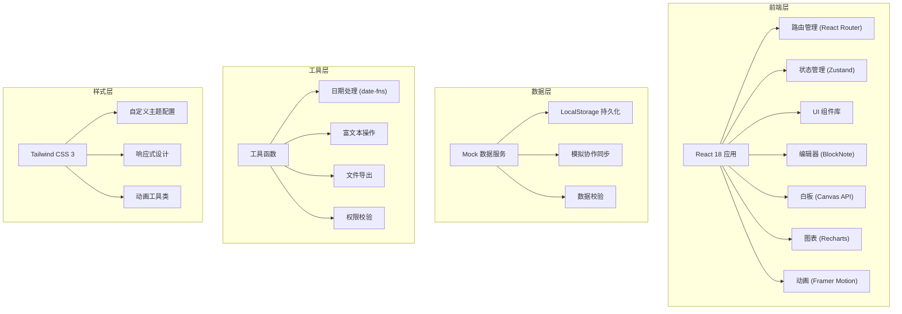
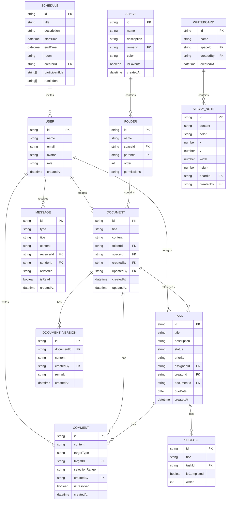

## 1. 架构设计



***

## 2. 技术栈说明

### 2.1 核心技术

* **前端框架**：React 18 + TypeScript

* **构建工具**：Vite 5

* **样式方案**：Tailwind CSS 3

* **路由管理**：React Router DOM v6

* **状态管理**：Zustand（轻量级，适合中小型应用）

* **动画库**：Framer Motion（流畅的页面切换和交互动画）

* **富文本编辑器**：BlockNote（块级编辑，支持表格、图片、代码块）

* **图表库**：Recharts（数据可视化，团队活跃度统计）

* **日期处理**：date-fns（轻量级日期工具库）

* **图标库**：Lucide React（线性图标，统一风格）

* **拖拽库**：@dnd-kit/core + @dnd-kit/sortable（任务看板、目录树拖拽）

### 2.2 项目初始化

使用 Vite 官方模板初始化 React + TypeScript 项目：

```bash
npm create vite@latest . -- --template react-ts
```

### 2.3 依赖安装

```bash
npm install react-router-dom zustand framer-motion blocknote @dnd-kit/core @dnd-kit/sortable recharts date-fns lucide-react
npm install -D tailwindcss@3 postcss autoprefixer @types/node
```

***

## 3. 目录结构

```
src/
├── assets/              # 静态资源（图片、字体等）
├── components/          # 通用组件
│   ├── layout/         # 布局组件（Sidebar、Header、MainLayout）
│   ├── ui/             # 基础 UI 组件（Button、Card、Modal、Avatar 等）
│   └── features/       # 业务组件（DocumentEditor、Whiteboard、TaskBoard 等）
├── hooks/               # 自定义 Hooks
├── store/               # Zustand 状态管理
│   ├── useAuthStore.ts
│   ├── useDocumentStore.ts
│   ├── useTaskStore.ts
│   ├── useMessageStore.ts
│   └── useScheduleStore.ts
├── data/                # Mock 数据
│   ├── users.ts
│   ├── documents.ts
│   ├── tasks.ts
│   ├── schedules.ts
│   └── messages.ts
├── pages/               # 页面组件
│   ├── Workbench.tsx
│   ├── Documents.tsx
│   ├── Whiteboard.tsx
│   ├── Tasks.tsx
│   ├── Schedule.tsx
│   ├── Messages.tsx
│   └── Management.tsx
├── types/               # TypeScript 类型定义
│   ├── index.ts
│   ├── document.ts
│   ├── task.ts
│   ├── user.ts
│   └── message.ts
├── utils/               # 工具函数
│   ├── date.ts
│   ├── export.ts
│   ├── permission.ts
│   └── storage.ts
├── styles/              # 全局样式
│   └── globals.css
├── App.tsx              # 根组件
├── main.tsx             # 入口文件
└── vite-env.d.ts
```

***

## 4. 路由定义

| 路由路径                         | 页面名称 | 说明                   |
| ---------------------------- | ---- | -------------------- |
| `/`                          | 工作台  | 数据概览、快捷入口、最近访问、团队动态  |
| `/documents`                 | 文档   | 空间列表、目录树、文档编辑器       |
| `/documents/:spaceId`        | 文档空间 | 指定空间的文档列表            |
| `/documents/:spaceId/:docId` | 文档编辑 | 文档详情编辑页面             |
| `/whiteboard`                | 白板   | 白板列表                 |
| `/whiteboard/:boardId`       | 白板编辑 | 白板协作编辑页面             |
| `/tasks`                     | 任务   | 任务看板视图               |
| `/tasks/:taskId`             | 任务详情 | 任务详情编辑页面             |
| `/schedule`                  | 日程   | 日历视图、会议安排            |
| `/messages`                  | 消息   | 消息列表、@提醒、评论通知        |
| `/management`                | 管理   | 空间管理、成员管理、权限配置、活跃度统计 |

***

## 5. 核心数据模型

### 5.1 ER 图



### 5.2 核心类型定义

```typescript
// User
interface User {
  id: string;
  name: string;
  email: string;
  avatar: string;
  role: 'admin' | 'member' | 'guest';
  createdAt: Date;
}

// Space
interface Space {
  id: string;
  name: string;
  description: string;
  ownerId: string;
  color: string;
  isFavorite: boolean;
  createdAt: Date;
}

// Document
interface Document {
  id: string;
  title: string;
  content: Block[];
  folderId: string | null;
  spaceId: string;
  createdBy: string;
  updatedBy: string;
  createdAt: Date;
  updatedAt: Date;
}

// Task
interface Task {
  id: string;
  title: string;
  description: string;
  status: 'todo' | 'in_progress' | 'review' | 'done';
  priority: 'low' | 'medium' | 'high' | 'urgent';
  assigneeId: string | null;
  creatorId: string;
  documentId: string | null;
  dueDate: Date | null;
  subtasks: SubTask[];
  createdAt: Date;
}

// Message
interface Message {
  id: string;
  type: 'mention' | 'comment' | 'task' | 'schedule' | 'system';
  title: string;
  content: string;
  receiverId: string;
  senderId: string;
  relatedId: string;
  isRead: boolean;
  createdAt: Date;
}

// Permission
interface Permission {
  folderId: string;
  userId: string;
  role: 'viewer' | 'editor' | 'manager';
}
```

***

## 6. 状态管理设计

### 6.1 Store 划分

```typescript
// useAuthStore.ts - 用户认证状态
interface AuthState {
  currentUser: User | null;
  users: User[];
  login: (email: string) => void;
  logout: () => void;
  getCurrentUser: () => User | null;
}

// useDocumentStore.ts - 文档相关状态
interface DocumentState {
  spaces: Space[];
  folders: Folder[];
  documents: Document[];
  versions: DocumentVersion[];
  comments: Comment[];
  activeSpaceId: string | null;
  activeDocumentId: string | null;
  createSpace: (data: Partial<Space>) => void;
  createDocument: (data: Partial<Document>) => void;
  updateDocument: (id: string, content: Block[]) => void;
  saveVersion: (docId: string, remark: string) => void;
  addComment: (comment: Omit<Comment, 'id' | 'createdAt'>) => void;
  convertParagraphToTask: (docId: string, blockId: string) => Task;
  searchDocuments: (keyword: string) => Document[];
  exportDocument: (docId: string, format: 'md' | 'pdf' | 'docx') => void;
  toggleFavorite: (spaceId: string) => void;
}

// useTaskStore.ts - 任务相关状态
interface TaskState {
  tasks: Task[];
  createTask: (data: Partial<Task>) => void;
  updateTask: (id: string, data: Partial<Task>) => void;
  updateTaskStatus: (id: string, status: Task['status']) => void;
  deleteTask: (id: string) => void;
  getTasksByStatus: (status: Task['status']) => Task[];
  getTasksByAssignee: (userId: string) => Task[];
}

// useScheduleStore.ts - 日程相关状态
interface ScheduleState {
  schedules: Schedule[];
  createSchedule: (data: Partial<Schedule>) => void;
  updateSchedule: (id: string, data: Partial<Schedule>) => void;
  deleteSchedule: (id: string) => void;
  getSchedulesByDate: (date: Date) => Schedule[];
  syncToCalendar: (scheduleId: string) => void;
}

// useMessageStore.ts - 消息相关状态
interface MessageState {
  messages: Message[];
  unreadCount: number;
  markAsRead: (id: string) => void;
  markAllAsRead: () => void;
  getMessagesByType: (type: Message['type']) => Message[];
  createMention: (mentionedUserId: string, content: string, relatedId: string) => void;
}
```

***

## 7. 核心功能实现方案

### 7.1 多人实时编辑（模拟）

```typescript
// hooks/useCollaborativeEditing.ts
import { useEffect, useRef } from 'react';

export const useCollaborativeEditing = (documentId: string, userId: string) => {
  const cursorPositions = useRef<Map<string, { x: number; y: number; userId: string }>>(new Map());
  const lastContent = useRef<string>('');
  
  useEffect(() => {
    // 模拟其他用户光标
    const mockCursors = setInterval(() => {
      // 随机更新其他用户光标位置
    }, 2000);
    
    // 模拟自动保存
    const autoSave = setInterval(() => {
      // 检查内容变化并保存版本
    }, 30000);
    
    return () => {
      clearInterval(mockCursors);
      clearInterval(autoSave);
    };
  }, [documentId]);
  
  return {
    cursorPositions,
    collaborators: [
      { userId: '2', name: '张三', color: '#FF6B35' },
      { userId: '3', name: '李四', color: '#2EC4B6' },
    ],
  };
};
```

### 7.2 版本历史与对比

```typescript
// utils/versionDiff.ts
export const calculateDiff = (oldContent: Block[], newContent: Block[]) => {
  // 使用 diff 算法计算内容差异
  // 返回添加、删除、修改的块列表
};

export const restoreVersion = (docId: string, versionId: string) => {
  // 从历史版本恢复文档内容
};
```

### 7.3 拖拽功能实现

使用 @dnd-kit 实现：

* 目录树拖拽排序

* 任务看板拖拽切换状态

* 白板便签拖拽移动

### 7.4 权限控制

```typescript
// utils/permission.ts
export const checkPermission = (
  userId: string,
  folderId: string,
  requiredRole: 'viewer' | 'editor' | 'manager'
): boolean => {
  // 检查用户在指定文件夹的权限
  // 继承父文件夹权限
  // 管理员拥有所有权限
};
```

### 7.5 文件导出

```typescript
// utils/export.ts
export const exportToMarkdown = (document: Document) => {
  // 将 Block 内容转换为 Markdown 格式
};

export const exportToPDF = async (document: Document) => {
  // 使用 html2pdf 或浏览器打印 API 导出 PDF
};
```

***

## 8. Mock 数据规划

### 8.1 初始数据

* 3 个示例空间（产品方案、项目管理、团队知识库）

* 15 篇示例文档（包含多级目录结构）

* 20 个示例任务（分布在不同状态列）

* 10 个示例日程（本周会议安排）

* 5 位团队成员（不同角色）

* 30 条示例消息（不同类型）

* 3 个示例白板（包含便签和图形）

### 8.2 数据持久化

使用 LocalStorage 存储：

* 用户登录状态

* 所有业务数据

* 个性化设置（主题、布局偏好）

***

## 9. 性能优化

1. **代码分割**：按路由懒加载页面组件
2. **虚拟列表**：长文档、长任务列表使用虚拟滚动
3. **防抖节流**：搜索输入、编辑器自动保存
4. **Memo 优化**：合理使用 React.memo、useMemo、useCallback
5. **状态隔离**：按模块拆分 Store，避免不必要的重渲染

***

## 10. 构建与部署

```json
{
  "scripts": {
    "dev": "vite",
    "build": "tsc && vite build",
    "lint": "eslint . --ext ts,tsx --report-unused-disable-directives --max-warnings 0",
    "preview": "vite preview"
  }
}
```

构建输出目录：`dist/`
